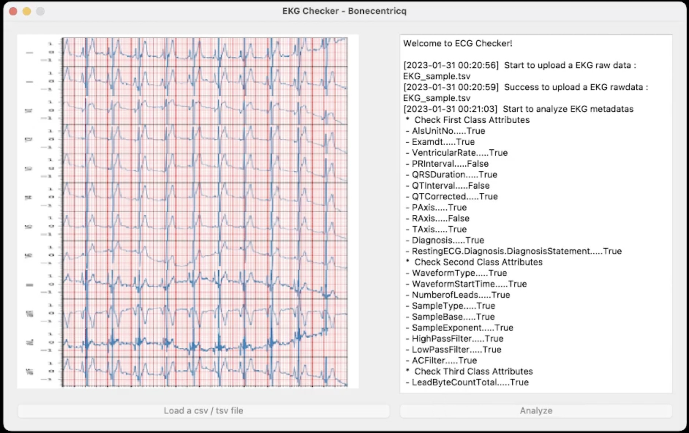

# LYDUS-ECG-Checker

Scripts for checking the ECG attributes and evaluating the integrity and accuracy of the labels.

## Information
  version: 1.0.3 (create: November 11, 2022,update: June 17, 2023)
 
 - This program is used to chekc your ecg files and give a score based on the integrity of attributes.
 - Data type and data range will be considered in the test. 
 - If a score of ECG is lower then 85, this ECG data may cause trouble to your research.

[](Media/ECG.mp4 "Video") 
 
 This program made by Yonsei Boncentricq Team

## ECG Attributes
- For ECG dataset, 38 ECG labels were selected as search criteria for both clinical and technical uses in GE MUSE. 
- The selected attributes were confirmed by experienced clinicians and cardiologists
  
|   No.  |   1st class                                |   2nd class                                        |   3rd class                                 |   Values/Range                                                           |   Type                 |   Sample1                         |
|--------|--------------------------------------------|----------------------------------------------------|---------------------------------------------|--------------------------------------------------------------------------|------------------------|-----------------------------------|
|   1    |   AlsUnitNo                                |   -                                                |   -                                         |   string                                                                 |   string               |   1911597                         |
|   2    |   Examdt                                   |   -                                                |   -                                         |   date                                                                   |   date                 |   201506                          |
|   3    |   VentricularRate                          |   -                                                |   -                                         |   0-999                                                                  |   integer              |   61                              |
|   4    |   PRInterval                               |   -                                                |   -                                         |   0-999                                                                  |   integer              |   152                             |
|   5    |   QRSDuration                              |   -                                                |   -                                         |   0-999                                                                  |   integer              |   96                              |
|   6    |   QTInterval                               |   -                                                |   -                                         |   0-999                                                                  |   integer              |   420                             |
|   7    |   QTCorrected                              |   -                                                |   -                                         |   0-999                                                                  |   integer              |   422                             |
|   8    |   PAxis                                    |   -                                                |   -                                         |   -179 to 180                                                            |   integer              |   8                               |
|   9    |   RAxis                                    |   -                                                |   -                                         |   -179 to 180                                                            |   integer              |   46                              |
|   10   |   TAxis                                    |   -                                                |   -                                         |   -179 to 180                                                            |   integer              |   56                              |
|   11   |   Diagnosis                                |   StmtFlag                                         |   -                                         |   ENDSLINE,DELETED,USERINSERT                                            |   string               |   ENDSLINE                        |
|   12   |                                            |   DiagnosisStmtText                                |   -                                         |   -                                                                      |   string               |   Nonspecific T wave abnormality  |
|   13   |   RestingECG.Diagnosis.DiagnosisStatement  |   StmtFlag                                         |   -                                         |   ENDSLINE,DELETED,USERINSERT                                            |   string               |   ENDSLINE                        |
|   14   |                                            |   RestingECG.Diagnosis.DiagnosisStatementStmtText  |   -                                         |   -                                                                      |   string               |   Nonspecific T wave abnormality  |
|   15   |   Waveform                                 |   WaveformType                                     |   -                                         |   Median/Rhythm                                                          |   string               |   Median                          |
|   16   |                                            |   WaveformWaveformStartTime                        |   -                                         |   32 bit usigned                                                         |   integer              |   0                               |
|   17   |                                            |   WaveformNumberofLeads                            |   -                                         |   8 or 11                                                                |   integer              |   8                               |
|   18   |                                            |   WaveformSampleType                               |   -                                         |   DISCRETE_SAMPLE/CONTINUOUS_SAMPLES/MULTIPLEX_SAMPLES./SIMPLEX_SAMPLES  |   string               |   CONTINUOUS_SAMPLES              |
|   19   |                                            |   WaveformSampleBase                               |   -                                         |   16 bit usigned                                                         |   integer              |   500                             |
|   20   |                                            |   WaveformSampleExponent                           |   -                                         |   8 bit usigned                                                          |   integer              |   0                               |
|   21   |                                            |   WaveformHighPassFilter                           |   -                                         |   16 bit usigned                                                         |   integer              |   16                              |
|   22   |                                            |   WaveformLowPassFilter                            |   -                                         |   16 bit usigned                                                         |   integer              |   150                             |
|   23   |                                            |   WaveformACFilter                                 |   -                                         |   None/50/60                                                             |   Integer <or> string  |   60                              |
|   24   |                                            |   WaveformLeadData                                 |   LeadByteCountTotal                        |   16 bit usigned                                                         |   integer              |   1200                            |
|   25   |                                            |                                                    |   WaveformLeadDataLeadTimeOffset            |   16 bit usigned                                                         |   integer              |   0                               |
|   26   |                                            |                                                    |   WaveformLeadDataLeadSampleCountTotal      |   16 bit usigned                                                         |   integer              |   600                             |
|   27   |                                            |                                                    |   WaveformLeadDataLeadAmplitudeUnitsPerBit  |   Float                                                                  |   Float                |   4.88                            |
|   28   |                                            |                                                    |   WaveformLeadDataLeadAmplitudeUnits        |   VOLTS/MILLIVOLTS/MICROVOLTS                                            |   string               |   MICROVOLTS                      |
|   29   |                                            |                                                    |   WaveformLeadDataLeadHighLimit             |   32 bit usigned                                                         |   integer              |   32767                           |
|   30   |                                            |                                                    |   WaveformLeadDataLeadLowLimit              |   32 bit usigned                                                         |   integer              |   -32768                          |
|   31   |                                            |                                                    |   WaveformLeadDataLeadID                    |   I/II/V1/V2/V3/V4/V5/V6/VCG-add X,Y,Z/Ped-add V3R.V4R.V7                |   string               |   I                               |
|   32   |                                            |                                                    |   WaveformLeadDataLeadOffsetFirstSample     |   16 bit usigned                                                         |   integer              |   0                               |
|   33   |                                            |                                                    |   WaveformLeadDataFirstSampleBaseline       |   32 bit usigned                                                         |   integer              |   0                               |
|   34   |                                            |                                                    |   WaveformLeadDataLeadSampleSize            |   8 bit usigned                                                          |   integer              |   2                               |
|   35   |                                            |                                                    |   WaveformLeadDataLeadOff                   |   TRUE/FALSE                                                             |   Boolean              |   FALSE                           |
|   36   |                                            |                                                    |   WaveformLeadDataBaselineSway              |   TRUE/FALSE                                                             |   Boolean              |   FALSE                           |
|   37   |                                            |                                                    |   WaveformLeadDataWaveFormData              |   Base64 encoded uncompressed raw signal data                            |   string               |   -                               |
|   38   |                                            |                                                    |   WaveformLeadDataLeadDataCRC32             |   32 bit usigned                                                         |   integer              |   3.41E+09                        |

## Funding
```
This research was supported by a grant of the Korea Health Technology R&D Project through the Korea Health Industry Development Institute (KHIDI),
funded by the Ministry of Health & Welfare, Republic of Korea (grant number : HI17C1234).
```

## Citation
```bibtex
@software{ECG-Checker,
  author = {Sang Wouk Cho, Sookyeoung Han, Namki Hong},
  organization = {Bonecentriq}
  title = {ECG-Checker},
  url = {https://github.com/Impku/LYDUS-ECG-Checker},
  version = {v1.0.3},
  date = {2022-11-11},
}
```
